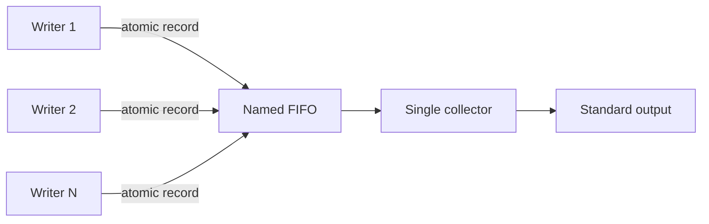

# Unix Systems Programming Lab

[](https://github.com/karol-preiskorn/unx_sys_programming/actions/workflows/ci.yml)

A collection of focused C programs for exploring Unix process behavior,
process attributes, `fork()`, `exec()`, Linux `/proc`, file descriptors, signal
dispositions, and named-pipe communication.

## Programs

| Program | Demonstrates |
| --- | --- |
| `fifo_pipe` | One collector and concurrent writers communicating through a named FIFO |
| `fork_env_z1` | Attributes inherited or changed after `fork()` |
| `exec_inheritance` | Attributes preserved or reset by `exec()` |
| `proc_by_user` | PID and command discovery for a user through Linux `/proc` |
| `example-1` | Independent parent and child copies of an in-memory counter |

## Requirements

- A POSIX-like environment for the process and FIFO examples
- Linux for `proc_by_user`
- GNU Make
- A C99 compiler such as GCC or Clang
- AddressSanitizer and UndefinedBehaviorSanitizer support for `make sanitize`
- Doxygen only when generating API documentation

## Quick Start

```bash
make -j4
make test
```

The build creates five executables under `bin/`:

```text
bin/example-1
bin/exec_inheritance
bin/fifo_pipe
bin/fork_env_z1
bin/proc_by_user
```

Use `make run` to execute every demonstration, including a process listing for
the current user.

For a complete local verification pass:

```bash
make check
make test
make -j4 sanitize
```

## FIFO Communication

### Self-Contained Mode

With no arguments, `fifo_pipe` creates a private temporary directory, forks a
collector, writes ten timestamped records, stops the collector, and removes the
FIFO and temporary directory:

```bash
./bin/fifo_pipe
```

Example output:

```text
#0 PID 12345: 2026-09-12 10:15:00
#1 PID 12345: 2026-09-12 10:15:00
...
#9 PID 12345: 2026-09-12 10:15:00
```

### Separate Reader and Writers

Start the collector before its writers:

```bash
# Terminal 1
./bin/fifo_pipe -r

# Terminal 2
./bin/fifo_pipe -w
```

The default shared path is `temp.fifo`. Use `-p` to choose another path:

```bash
./bin/fifo_pipe -r -p /tmp/build-events.fifo
./bin/fifo_pipe -w -p /tmp/build-events.fifo
```

Additional writers can connect concurrently. Stop the collector with `Ctrl+C`;
it closes and removes its FIFO. Only one collector can own a FIFO at a time.
A writer retries briefly while waiting for a collector and reports an error if
none becomes available.

```text
Usage: ./bin/fifo_pipe [-r | -w] [-p FIFO_PATH]
       ./bin/fifo_pipe -h
  -r  collect and display messages
  -w  write ten messages to a collector
  -p  use FIFO_PATH instead of temp.fifo
  -h  display this help
```

Each record is smaller than `PIPE_BUF` and is sent with one `write()` call, so
POSIX guarantees that records from concurrent writers are not interleaved. The
reader verifies the opened object is a FIFO and uses an advisory lock to reject
a second collector. Writers ignore `SIGPIPE` and report a normal `EPIPE` error
if a collector disappears during transmission.



### FIFO Troubleshooting

| Message or symptom | Meaning and action |
| --- | --- |
| `open FIFO for writing: No such device or address` | No collector accepted the FIFO during the retry period; start `-r` first and retry the writer. |
| `another collector already owns ...` | A reader already holds the FIFO lock; use the existing collector or choose another path with `-p`. |
| `... exists but is not a FIFO` | The requested path names another file type; choose another path instead of deleting an unknown file. |
| FIFO remains after an uncatchable signal such as `SIGKILL` | Run `make clean` for the default path or remove a known custom FIFO after verifying it with `test -p PATH`. |

## Fork Inheritance

```bash
./bin/fork_env_z1
```

The program prints process state before `fork()`, in the child, and in the
parent after the child exits. It demonstrates:

- new PID and PPID relationships;
- inherited user, group, and session identifiers;
- inherited working directory and file-creation mask;
- an inherited descriptor for `/dev/null`;
- inherited environment data and resource limits; and
- independent global and automatic variables in each address space.

The child increments its copies of the variables while the parent retains its
original values.

## Exec Inheritance

```bash
./bin/exec_inheritance
```

The parent configures process state, forks, and has the child replace its image
by executing the same program in reporting mode. The report demonstrates that:

- PID, PPID, working directory, environment, and resource limits survive;
- a normal open descriptor remains open;
- a descriptor marked `FD_CLOEXEC` is closed;
- an ignored signal disposition remains ignored; and
- a caught signal disposition resets to its default action.

## Processes by User

```bash
./bin/proc_by_user "$USER"
make run-proc USER=root
```

`proc_by_user` resolves the supplied account with `getpwnam()`, visits numeric
directories under `/proc`, filters them by owner, reads `/proc/PID/comm`, and
prints a PID-sorted table. Processes can disappear during enumeration; those
races and unreadable entries are skipped safely.

## Minimal Fork Example

```bash
./bin/example-1
```

The parent and child increment separate copies of a counter from 1 through 5.
The parent uses `waitpid()` to reap the child before exiting. Scheduling still
controls whether parent or child counter lines are printed first.

## Testing

`make test` runs behavioral integration tests from `tests/run.sh`. The suite
checks:

- ten-record self-contained FIFO operation;
- two concurrent FIFO writers and record integrity;
- rejection of a second collector;
- FIFO cleanup and no-reader failure;
- conflicting command-line modes;
- parent/child variable isolation;
- `exec()` environment, descriptor, and signal behavior;
- counter output and child synchronization; and
- `/proc` listing plus invalid-user handling.

Run the same suite with runtime instrumentation:

```bash
make -j4 sanitize
```

The GitHub Actions workflow builds and tests with GCC and Clang, then runs a
separate sanitizer job.

The integration script can also be run directly after building:

```bash
./tests/run.sh
```

## Make Targets

| Target | Purpose |
| --- | --- |
| `make` or `make all` | Build all five executables |
| `make check` | Check every C source with the configured warnings |
| `make test` | Run the behavioral integration suite |
| `make sanitize` | Rebuild and test with ASan and UBSan |
| `make run` | Run all demonstrations |
| `make run-fifo` | Run self-contained FIFO communication |
| `make run-fork` | Run the `fork()` inheritance example |
| `make run-exec` | Run the `exec()` inheritance example |
| `make run-proc` | List processes owned by `USER` |
| `make run-example` | Run the minimal `fork()` example |
| `make docs` | Generate Doxygen HTML and LaTeX output |
| `make rebuild` | Clean and rebuild every executable |
| `make clean` | Remove binaries, objects, and the default FIFO |
| `make clean-all` | Also remove generated documentation |
| `make info` | List detected sources and configured executables |
| `make help` | Display the primary targets |
| `make verbose` | Build with verbose compiler output |
| `make install` | Install executables under `PREFIX/bin` |
| `make uninstall` | Remove installed executables |

The default warning set is intentionally strict:

```text
-Wall -Wextra -Wpedantic -Wformat=2 -Wshadow -Wconversion -std=c99
```

Override the compiler or flags when needed:

```bash
make CC=clang CFLAGS="-Wall -Wextra -std=c99 -O2"
```

## Installation

The default prefix is `/usr/local`, which may require elevated permissions. A
user-local installation avoids that requirement:

```bash
make install PREFIX="$HOME/.local"
make uninstall PREFIX="$HOME/.local"
```

Packaging tools can stage files separately from their final prefix:

```bash
make install DESTDIR=/tmp/package-root PREFIX=/usr
make uninstall DESTDIR=/tmp/package-root PREFIX=/usr
```

## Documentation

Generate API documentation with:

```bash
make docs
```

Generated `html/` and `latex/` directories are ignored by Git. `make clean-all`
removes them while preserving the source-controlled `doxy.Doxyfile`.

## Extending the Lab

To add another standalone example:

1. Add a source file containing `main()` under `src/`.
2. Add its executable name to `PROGRAMS` in the Makefile.
3. Add behavior assertions to `tests/run.sh`.
4. Add a short usage section to this README.

Reusable modules such as `fifo_io.c` do not belong in `PROGRAMS`. Add them as
explicit prerequisites and linker inputs for the executable that owns them,
following the existing `fifo_pipe` rule.

Before submitting a change, run:

```bash
make clean
make -j4 all
make check
make test
make -j4 sanitize
git diff --check
```

## Project Layout

```text
.
|-- .github/workflows/ci.yml
|-- Makefile
|-- README.md
|-- doxy.Doxyfile
|-- src/
|   |-- example-1.c
|   |-- exec_inheritance.c
|   |-- fifo_io.c
|   |-- fifo_io.h
|   |-- fifo_pipe.c
|   |-- fork_env_z1.c
|   `-- proc_by_user.c
|-- tests/run.sh
`-- bin/                         # generated by make
```

`fifo_io.c` contains reusable FIFO transport logic, while `fifo_pipe.c` owns
command-line parsing and process orchestration. The other source files are
standalone programs.
